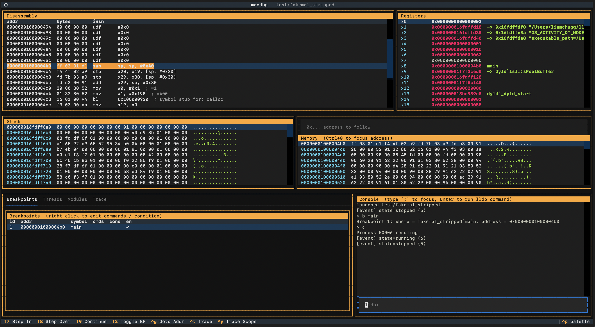
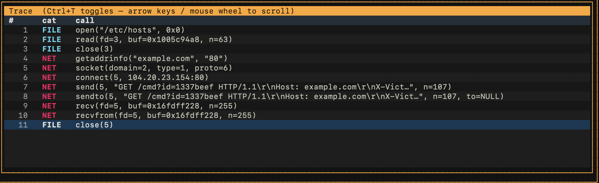
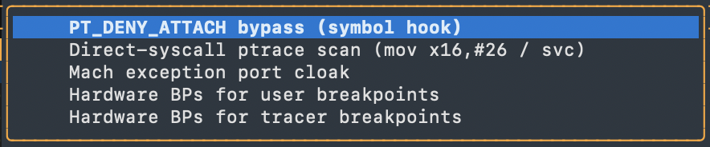
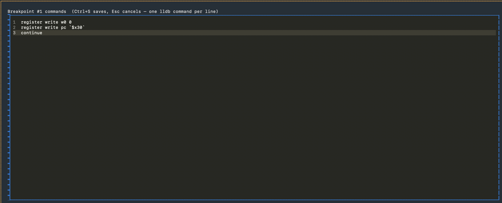
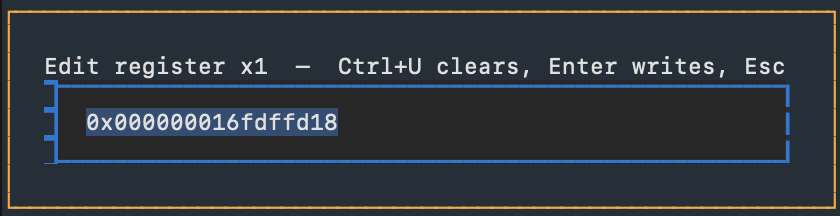
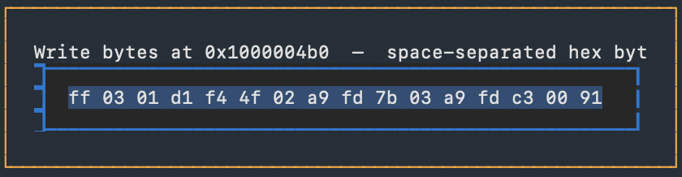
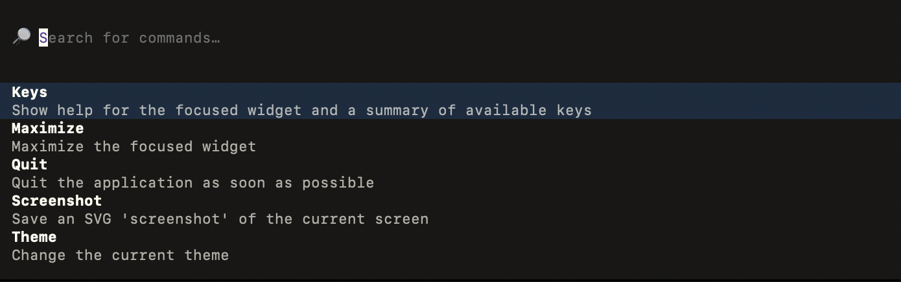
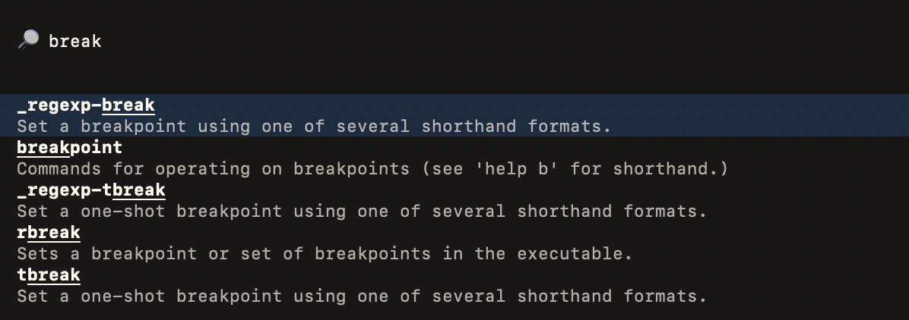
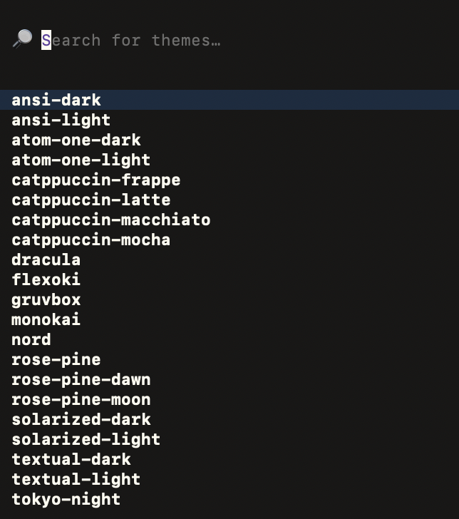

# macdbg

A Textual TUI for Apple's system LLDB. Gives you a multi-pane view of the running process. Includes a lazy syscall & network tracer, defeats anti-debugging checks, and lets you edit registers and memory in place.



## How To Use It

As simple as:
```sh
./macdbg.sh /path/to/your/binary
```

Requires macOS with Xcode Command Line Tools installed.

## Syscall and Network Tracer

Feeling lazy? Ctrl+T arms pending breakpoints on file, process, and network entry points in libSystem. Each hit logs the call with parsed arguments and the process auto-continues, so tracing does not stop execution.



## Anti-anti-debug

Ctrl+D opens a menu of independent bypass toggles, all off by default:



- **PT_DENY_ATTACH bypass** hooks `ptrace` and returns `0` when the deny flag is set, so the kernel never sees the call.
- **Direct-syscall ptrace scan** catches the same denial when the sample skips libc and issues `svc #0x80` inline.
- **Mach exception port cloak** hooks `task_get_exception_ports` and returns zero ports, so nothing looks attached.
- **Hardware BPs for user breakpoints** stops user breakpoints from patching bytes in `__TEXT`, which beats prologue-hash checks.
- **Hardware BPs for tracer breakpoints** does the same for tracer BPs. Flip it before enabling the tracer.
- **Fork identity mode** makes `fork` return `0` and `setsid` return a positive fake sid, so the parent runs the child code path in-process and no debugger reattach is needed.
- **Outbound exec sandbox** hooks `system`, `popen`, `execve`, `execvp`, `posix_spawn`, and `posix_spawnp`. Auto-block returns `-1` to every call; interactive halts on each and prompts Allow or Block.

### What The Fork Bypass Defeats

This is the macOS daemonization gate. Parent exits to look like normal termination, and the child re-parents to launchd and detaches from the controlling TTY so a debugger attached to the parent loses visibility. If either call fails, the sample bails without running the payload.

```c
pid_t pid = fork();
if (pid < 0) {
    return;
}
if (pid > 0) {
    _exit(0);
}

pid_t sid = setsid();
if (sid < 0) {
    return;
}
```

The compiled form checks the sign bit directly (`tst x0, #0x80000000` or `tbnz x0, #31, <bail>`) rather than comparing to `-1`. Fork identity mode returns `0` from `fork` and a positive value from `setsid` so both branches walk into the payload block instead of the abort path.

### What The Exec Sandbox Defeats

Samples that harden themselves against dynamic analysis by killing the analyst's environment. A common pattern is `killall Terminal`.

```c
system("uname -a");
if (some_check()) {
    system("killall Terminal");
}
decrypt_c2_config();
```

Auto-block mode intercepts every outbound exec and returns `-1`. Interactive mode is more useful for real triage: the recon `system("uname -a")` gets an Allow so the sample sees real output. The `system("killall Terminal")` gets a Block and returns `-1`. Sample believes both fired and keeps executing into the payload.

## Breakpoint Scripting

The Breakpoints tab shows id, address, symbol, attached-command count, condition, and enabled state. Right-click any breakpoint row → **Edit commands** and you get a full-screen editor for the lldb command list. Ctrl+S saves and Esc cancels. One lldb command per line, exactly as if you'd used the interactive `breakpoint command add` form without the multi-line prompt.



## Edit Registers and Memory

Right-click any register row and pick **Edit value**. The prompt is prefilled with the current value so you can see what you're overwriting, and Ctrl+U clears it if you want to replace it all.



Right-click any memory or stack row and pick **Edit bytes**. Same idea, prefilled with the current 16 bytes as space-separated hex.



## Command Palette

Ctrl+P opens a fuzzy palette over every lldb command, with lldb's own help text as the description.





## Themes

Lots of themes to choose from :)



## Keys

| Key | Action |
|-----|--------|
| F7 | Step in (instruction) |
| F8 | Step over (instruction) |
| F9 | Continue |
| F2 | Toggle breakpoint at pc |
| Enter (in disasm) | Follow operand address in the memory pane |
| `:` | Focus the console command bar |
| Ctrl+G | Focus the memory follow-address input |
| Ctrl+P | Command palette |
| Ctrl+T | Toggle the tracer |
| Ctrl+K | Clear the trace tab |
| Ctrl+Y | Cycle trace scope (strict / balanced / wide / off) |
| Ctrl+D | Defenses menu |
| Ctrl+C | Quit |
| Right click on a row | Pane-specific context menu |

Whatever you type in the console goes into `SBCommandInterpreter.HandleCommand`. If a command would trigger an interactive Y/N prompt (`run`, `br del`), the wrapper answers it for you before the command reaches lldb.
