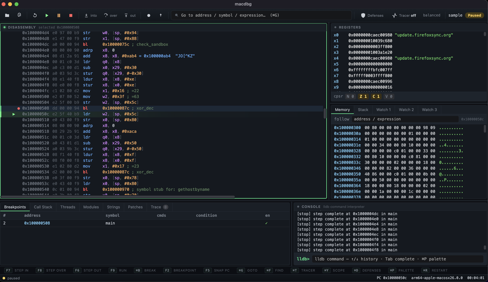
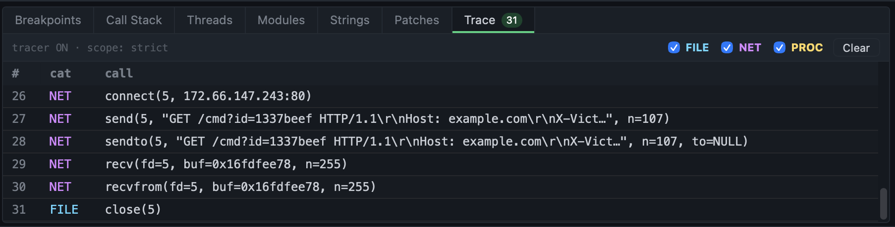
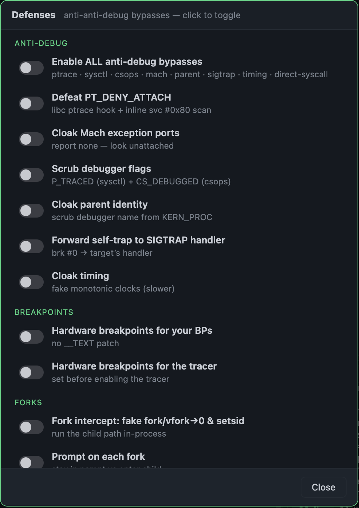
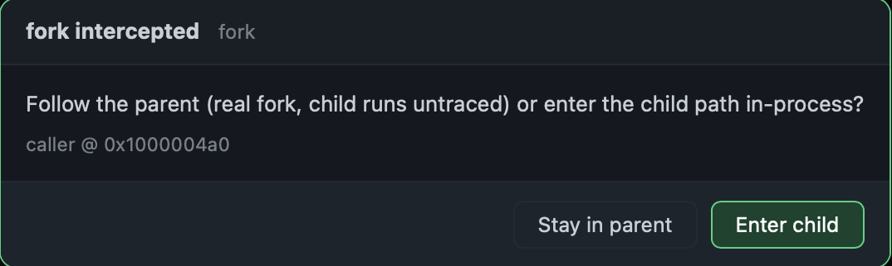
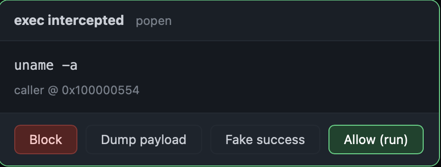
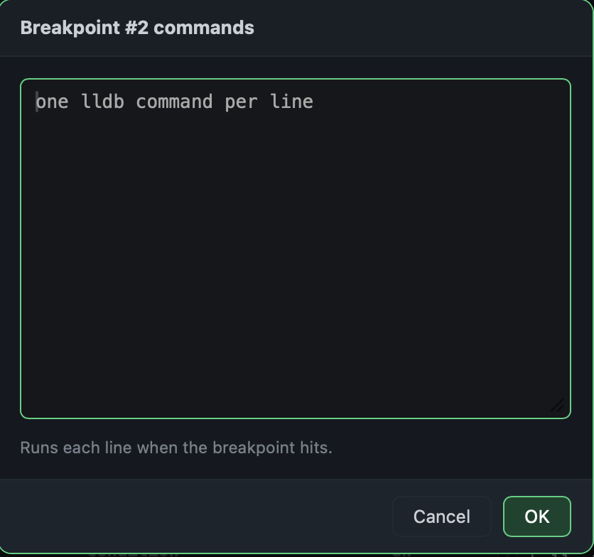
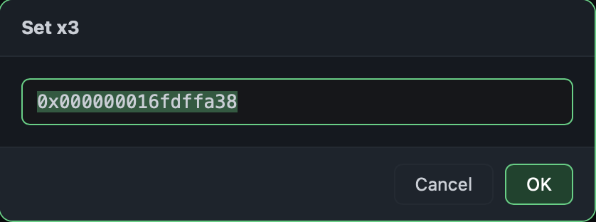
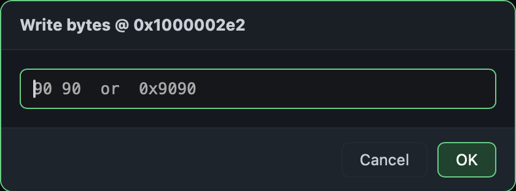
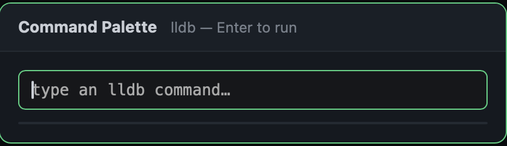

# macdbg

A GUI for LLDB. Gives you a multi-pane view of the running process. Includes a lazy syscall & network tracer that works on forked processes, defeats anti-debugging checks, and lets you edit registers and memory in place.



## Who Is This For

Reverse engineers and malware analysts debugging macOS binaries who aren't very good at remembering CLI commands and want an experience closer to x64dbg. The Trace tab gives results with no breakpoints needed and the debugger has built-in functionality to defeat common anti-debug techniques.

## Requirements

* ARM64 macOS with the Xcode Command Line Tools installed
* pywebview


## Install

```sh
git clone https://github.com/MZHeader/macdbg
cd macdbg/GUI
./run.sh /path/to/your/binary
```
Or, simply open `GUI/macdbg.app`

### Air-gapped machines

`run.sh` opens the native window through pywebview. On a machine with no internet, grab the bundle for its Python version from the [native-deps release](https://github.com/MZHeader/macdbg/releases/tag/native-deps), copy it over, and install it locally:

```sh
GUI/get-native-deps.sh ./pywebview-macos-arm64-cp313.tar.gz
```

After that `run.sh` finds it and runs offline. The release notes cover picking the right version for your Python.

## Syscall and Network Tracer

Feeling lazy? `⌘T` arms breakpoints on common file, process, and network entry points in libSystem. Each hit logs the call with parsed arguments and the process auto-continues, so tracing does not stop execution.



## Anti-anti-debug

`⌘D` opens a menu of toggles, all off by default.



**Anti-debug**

* **Defeat PT_DENY_ATTACH via libc** hooks `ptrace` and returns `0`, so the deny flag never reaches the kernel.

    * **Defeat inline PT_DENY_ATTACH** catches the same call when the sample skips libc and runs `svc #0x80` directly.

* **Cloak Mach exception ports** hooks `task_get_exception_ports` to report none, so the process looks unattached.

* **Scrub P_TRACED from sysctl** lets `sysctl(KERN_PROC)` run, then clears the `P_TRACED` bit in the returned `kinfo_proc` so the classic sysctl check sees an untraced process.

    * **Scrub CS_DEBUGGED from csops** does the same for `csops(CS_OPS_STATUS)`, clearing the `CS_DEBUGGED` code-signing flag modern samples check.

* **Cloak parent identity** scrubs the debugger's name out of `sysctl(KERN_PROC)` results.

* **Forward self-trap brk #0** runs the target's own `SIGTRAP` handler for a breakpoint instruction it planted on itself, the way the kernel would with no debugger attached.

* **Cloak timing (Experimental)** feeds the common monotonic clock sources (`mach_absolute_time`, `mach_continuous_time`, `clock_gettime_nsec_np`) a fake clock, so a sample that *times* a sensitive call to catch the latency a flag-scrubber adds sees a normal, tiny delta.

**Breakpoints**

* **Hardware breakpoints for your breakpoints** leave the bytes in `__TEXT` untouched, so a prologue-hash check passes.
* **Hardware breakpoints for the tracer** do the same for tracer BPs. Turn it on before `⌘T`.

**Forks**
> For cases where the sample forks, the parent exits, and the child detaches with `setsid`.

* **Run child path in-process** fakes `fork`/`vfork` to `0` and `setsid` to a real sid.
* **Prompt each fork** stops on every fork and asks whether to stay in the parent or enter the child. Answer per site.
* **Trace the whole fork tree** shows the syscalls of children lldb can't follow.



**Exec**
> For samples that call something like `killall Terminal`, we can just intercept it, say no, and spoof a success result.

* **Intercept outbound exec** hooks `system`, `popen`, `execve`, `execvp`, `posix_spawn`, and `posix_spawnp`.
* **Prompt each call** offers Allow, Fake success, Block, or Dump per call, otherwise auto-blocks.



## Breakpoint Scripting

The Breakpoints tab shows id, address, symbol, attached-command count, condition, and enabled state. Right-click any breakpoint row → **Edit commands** and you get a multi-line editor for the lldb command list. Save (⌘Enter) or cancel (Esc). One lldb command per line, exactly as if you'd used the interactive `breakpoint command add` form without the multi-line prompt.



## Edit Registers and Memory

Right-click any register row and pick **Edit value**. The prompt is prefilled with the current value so you can see what you're overwriting; select all (⌘A) to replace it.



Right-click any memory or stack row and pick **Edit bytes**. Same idea, prefilled with the current 16 bytes as space-separated hex.



## Command Palette

⌘P opens a fuzzy palette over every lldb command, with lldb's own help text as the description.



## Headless / agentic

`./agent.sh` is the same debugger core driven by JSON over a per-session Unix socket instead of the window. Made for scripts, cron jobs, and agentic use. A session daemon holds one live LLDB session and keeps state (breakpoints, register overrides, patched memory) between commands.

```sh
./agent.sh start --session s1 /path/to/binary   # --session is optional; auto-named otherwise
./agent.sh cmd s1 breakpoint_toggle --json '{"addr": "0x100003f88"}'
./agent.sh cmd s1 continue
./agent.sh status s1
./agent.sh stop s1
```

Subcommands are `start`, `cmd`, `status`, `interrupt`, `stop`, `list`, and `logs`. Every JSON handler has an equivalent to what the debugger does in the window, plus a `raw` command that runs any lldb command literally.

A Claude Code skill at `.claude/skills/macdbg-agent/SKILL.md` documents the protocol plus recipes for reversing Cocoa apps. Drop this repo into a project and Claude drives the debugger directly.

## Keys

These mirror the shortcut bar along the bottom of the window. Modifier shortcuts accept ⌘ or Ctrl.

| Key | Action |
|-----|--------|
| F7 | Step in (instruction) |
| F8 | Step over (instruction) |
| F6 | Step out (execute till return) |
| F9 | Run / continue |
| F2 | Toggle breakpoint at the selected line (or pc) |
| F5 | Snap the disassembly back to pc (after browsing) |
| F3 | Open a target |
| ⌘B | Break / interrupt a running process |
| ⌘G | Go to an address, symbol, or expression |
| ⌘F | Find in process memory (target scope; prefix `all:` for libraries) |
| ⌘T | Toggle the tracer |
| ⌘Y | Cycle trace scope (strict / balanced / wide / off) |
| ⌘K | Clear the trace tab |
| ⌘D | Defenses menu |
| ⌘P | Command palette |
| ⌘R | Restart (kill and re-run to the entry point) |
| ⌘C | Copy the current selection |
| Click a disasm line | Select it — breakpoint / Set PC / Run-to-cursor act on the selection |
| Double-click a disasm line | Toggle a breakpoint there |
| Right-click a row | Pane-specific context menu |
| ↑ / ↓ in the console | Command history (Tab completes) |
| Esc | Close a menu or dialog |

Whatever you type in the console goes into `SBCommandInterpreter.HandleCommand`. If a command would trigger an interactive Y/N prompt (`run`, `br del`), the wrapper answers it for you before the command reaches lldb.

## Additional Features

- **Memory search.** Target-only scope by default (binary plus heap and stack). Prefix `all:` to widen to loaded libraries. ⌘F Enter cycles to the next hit.
- **Per-binary persistence** at `~/.macdbg/<name>-<sha>/state.json`. Breakpoints with conditions and command scripts, comments, and bookmarks come back next time you open the same binary. The directory is named for the binary but suffixed with a slice of its sha256, so two samples that share a name never collide; dumps for the same sample sit alongside in `dumps/`. Old flat `~/.macdbg/<sha256>.json` files migrate here automatically on first open.
- **Disasm comments.** Right-click a disasm row and pick **Add comment**. Persists across sessions and renders as a bold gold `← note` in the disasm line.
- **Jump arrow gutter.** Left-side control flow lines for every branch whose source and target are both visible. At the current pc, the arrow is colored **green if the branch will be taken** and **red if not**, evaluated live from register values and CPSR flags.
- **Function name markers.** `▼ funcname:` banner rows at function boundaries wherever lldb has symbol info.
- **Inline dereference hints.** `adrp + add` and `adrp + ldr` pairs get a bright blue `; = 0x…  "resolved string"` or `; load @ 0x…  symbol` comment showing what the address materializes to, right in the disasm line.
- **Follow in disassembly.** Right-click a call or branch operand, or a register value, pick Follow in disassembly, and browse that address without moving pc. F5 snaps back.
- **Call Stack tab.** Full backtrace of the selected thread with pc, function, and module.
- **Watch windows.** Three pinned mini hexdumps next to Memory and Stack. Right-click any address, register value, memory row, or string → **Follow in Watch 1/2/3** to pin it. The address stays put as you step; only the bytes refresh. Handy for watching an inline decryption stub fill a stack buffer with plaintext byte by byte. Bindings persist per binary in `~/.macdbg/<name>-<sha>/state.json`. Right-click a watch pane for length, label, and clear controls.