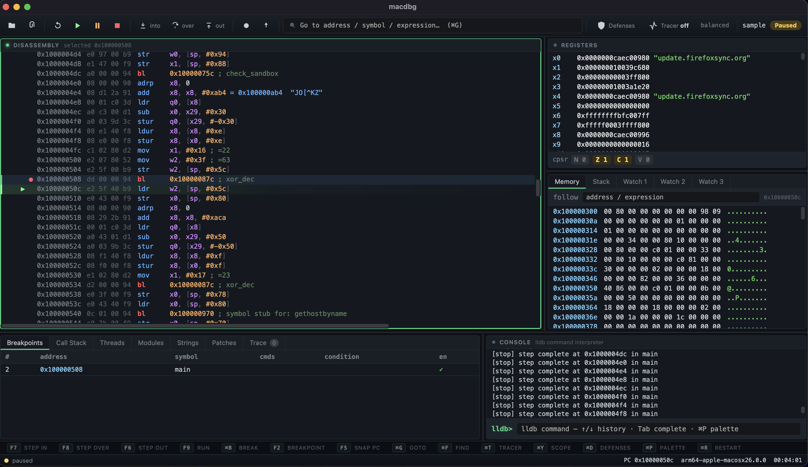
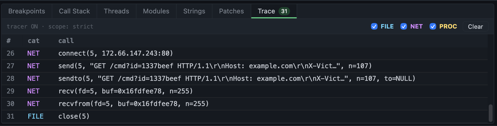
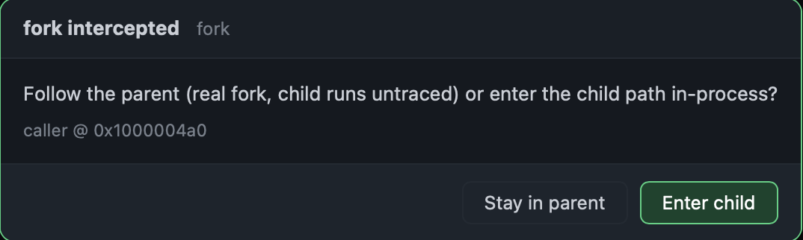
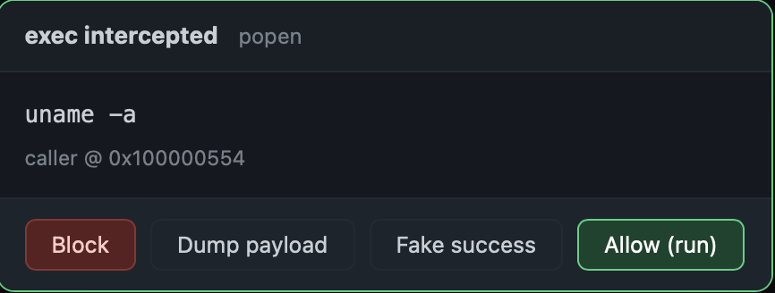
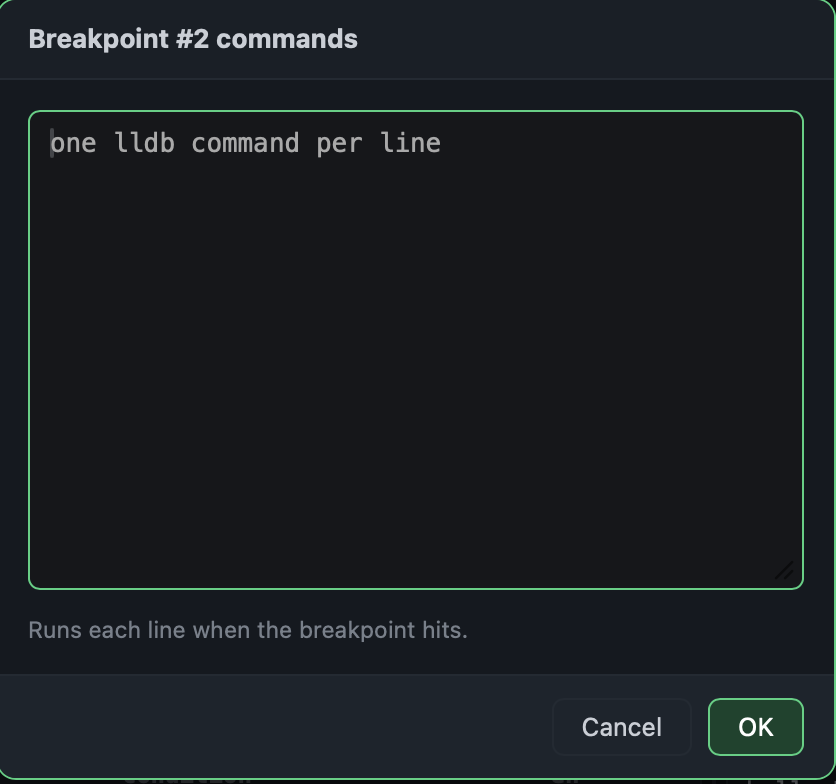
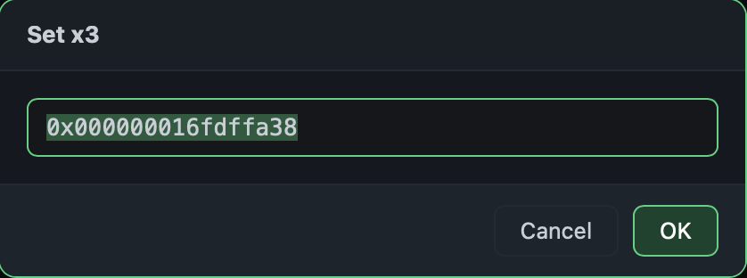
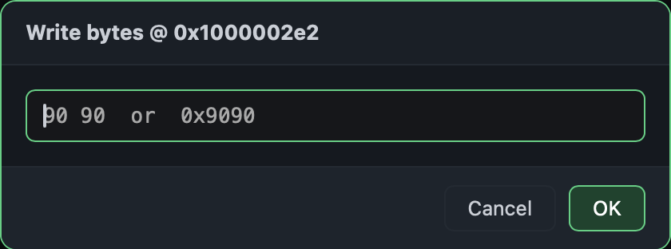
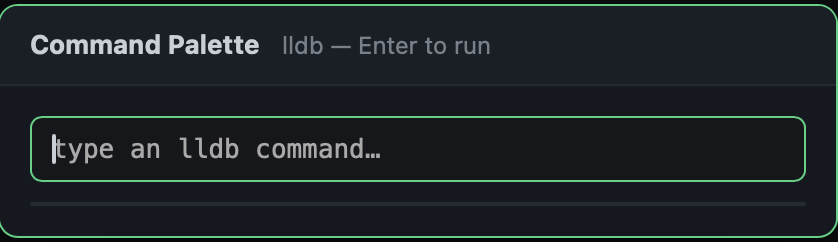

# macdbg

A GUI for LLDB. Gives you a multi-pane view of the running process. Includes a lazy syscall & network tracer that works on forked processes, defeats anti-debugging checks, and lets you edit registers and memory in place.



## Who Is This For

Reverse engineers and malware analysts debugging macOS binaries who aren't very good at remembering CLI commands and want an experience closer to x64dbg. The Trace tab gives results with no breakpoints needed and the debugger has built-in functionality to defeat common anti-debug techniques.

## Requirements

* ARM64 macOS with the Xcode Command Line Tools installed
* pywebview


## Install

```sh
git clone https://github.com/MZHeader/macdbg
```

Then double-click **`macdbg.app`**. Pick a binary from **File > Open**, or launch straight into one:

```sh
open macdbg.app --args /path/to/your/binary
```

Prefer a terminal? `GUI/run.sh /path/to/your/binary` is the CLI equivalent - it's the same launcher the app runs for you.

### Air-gapped machines

macdbg opens its native window through pywebview. On a machine with no internet, grab the bundle for its Python version from the [native-deps release](https://github.com/MZHeader/macdbg/releases/tag/native-deps), copy it over, and install it locally:

```sh
GUI/get-native-deps.sh ./pywebview-macos-arm64-cp313.tar.gz
```

After that `run.sh` finds it and runs offline. The release notes cover picking the right version for your Python.

## Syscall and Network Tracer

Feeling lazy? `⌘T` arms breakpoints on common file, process, and network entry points in libSystem. Each hit logs the call with parsed arguments and the process auto-continues, so tracing does not stop execution.



## Anti-anti-debug

`⌘D` opens a menu of toggles, all off by default.

### Analysis cloak (ARM64)

**Analysis cloak** is the composite defense for samples that combine several
environment and debugger checks with a `__TEXT,__text` integrity hash. Open a
target, leave it stopped at the initial entry point, press `⌘D`, and click
**Analysis cloak** in the **Recommended** section. The row reports whether the
cloak is safe and how many API hooks are resolved or deferred. Individual
controls, including **Enable ALL anti-debug bypasses**, live under
**Advanced / individual defenses**. If the target has already run, restart it
and enable the cloak at the new entry stop.

Opening or attaching to another target turns off the previous target's
defenses and clears its internal hooks. Enable the cloak again at the new
target's entry stop. Restarting the same target preserves the requested mode.

The equivalent headless sequence is:

```sh
./agent.sh start --session cloak /path/to/binary
./agent.sh cmd cloak defense_enable --json '{"name":"analysis_cloak"}'
./agent.sh cmd cloak status
./agent.sh cmd cloak continue --json '{"timeout":15}'
./agent.sh stop cloak
```

Disable it with `defense_disable` and the same `{"name":"analysis_cloak"}`
payload. Always stop the session when finished.

The composite defense covers these analysis signals:

* It removes `DYLD_INSERT_LIBRARIES`, `DYLD_FORCE_FLAT_NAMESPACE`,
  `DYLD_PRINT_LIBRARIES`, `DYLD_PRINT_INITIALIZERS`, `DYLD_PRINT_BINDINGS`,
  `DYLD_IMAGE_SUFFIX`, `MallocStackLogging`, `MallocStackLoggingNoCompact`, and
  `NSZombieEnabled` from the launch environment and the stopped target's live
  environment. This keeps `getenv`, `_NSGetEnviron`, and direct `environ`
  inspection consistent.
* It lets `sysctl(KERN_PROC)` and `proc_pidpath` complete, then hides known
  debugger/analyzer parent names. A suspicious process name becomes `launchd`;
  a suspicious full path becomes `/sbin/launchd`. Unrelated paths pass through.
* It virtualizes recognized `sysctlbyname` queries with deterministic results:
  `kern.hv_vmm_present = 0`, `hw.model = Mac14,6`, and
  `machdep.cpu.brand_string = Apple M2 Pro`. `kern.hostuuid` returns the same
  UUID as the IOKit profile below (37 bytes including its terminating NUL).
  Unsupported-query errors, including `ENOENT`, remain unchanged.
  Successful length-only probes
  publish the spoofed size for the caller's subsequent data query.
* It replaces the two recognized `IORegistryEntryCreateCFProperty` results with
  `IOPlatformSerialNumber = C02ZQ0ABC123` and
  `IOPlatformUUID = 8D4C7A12-3F65-4B90-A2DE-61C8E5079F34`.
* It hides configured instrumentation library names returned by
  `_dyld_get_image_name`, substituting `/usr/lib/libSystem.B.dylib` without
  overwriting dyld-owned memory.
* It reuses the P_TRACED scrub for `sysctl` and syscall number 202.

The cloak protects the sample's text bytes; it does not forge SHA-256 results.
While it is enabled, macdbg-managed breakpoints in the main executable's
`__TEXT,__text` become hardware breakpoints, target-text patches block resume,
and tracer sites in that section must use hardware mode. ARM64 has a finite
number of hardware breakpoint slots, and a bounded step plan reserves one. If
the required slot is unavailable, breakpoint creation or resume fails instead
of falling back to a software breakpoint.

Instruction step-in is supported. Ordinary instruction step-over and
non-inlined step-out are supported as bounded hardware-only plans. Source-level
stepping and step-out from an inline frame fail closed; use instruction
stepping instead. The headless `raw` command remains an unrestricted LLDB
escape hatch and can create software breakpoints, patch text, or delete
internal defenses, so it can invalidate the cloak's guarantees.

Timing checks have a separate **Hide debugger pauses** automatic mode and
advanced **Timing rules**, described below. The analysis cloak does not enable
either mode or change clock values. The former
fixed-step synthetic clock remains removed because it was fingerprintable and
changed normal monotonic-clock semantics. Arbitrary private or undocumented
inspection APIs remain outside the current scope.
The cloak is also deliberately incompatible with **Trace the whole fork
tree**: fork-tree tracing injects a DYLD interposer, which would itself trip the
environment and loaded-image checks. Enabling either feature while the other is
active is rejected.

**Hide debugger pauses (ARM64)** is the automatic option. Enable it at the
initial entry stop from Defenses, or use the headless API:

```sh
./agent.sh cmd SESSION defense_enable --json '{"name":"auto_clock"}'
./agent.sh cmd SESSION clock_status
```

No timing-rule addresses, thresholds, registers or decoded symbol names are
needed. macdbg resolves the OS implementations of `mach_absolute_time`,
`mach_continuous_time`, `clock_gettime`, and `gettimeofday` itself. Calls from
the main executable receive the corresponding host clock value minus observed
debugger-stop time, with the appropriate tick/nanosecond conversion. Normal
execution and deliberate program sleeps still advance time. Monotonic results
are kept nondecreasing; there is no fixed increment per read.

The same toggle scans up to 4 MiB of the main executable's current text for
`mrs ..., cntvct_el0` and `cntpct_el0`. Recognized reads use hardware
breakpoints and a host-only counter reader, which is compiled into the state
directory on first use and never injected into the target. If hardware slots
cannot cover the counter sites while reserving a step slot, API compensation
stays available and the UI/status explicitly reports partial counter coverage.
The executable's Mach-O clock imports and successful `dlsym` clock lookups
are routed through small process-local forwarders. Their page is written first,
then protected read/execute; clock arithmetic stays in the debugger. Software
breakpoints live on these forwarders, leaving system clock routines and main
`__text` unchanged. Use Analysis cloak alongside this mode for broader
target-text protection.

The pause budget is shared by all threads and updated across continue,
instruction stepping and internal defense/tracer stops. GUI event observation
timestamps include time spent waiting in its event queue. Clock calls from
outside the main executable, unsupported clock IDs (including CPU clocks),
and invalid output buffers run through the original API. Successful clock
buffer writes are not recorded as code/data patches.

`mach_wait_until` deadlines supplied by the main executable are interpreted
as virtual Mach deadlines and translated back to real time at API entry.
This preserves ordinary waits derived from the compensated clock. Pausing
again during an already-running kernel wait is not virtualized; neither are
other absolute-deadline APIs or deadlines obtained from external clock sources.
Framework-internal clocks and scheduling remain on real time.

`clock_status` reports enabled/safe/error, API names, per-source hit counts,
passthrough count, forwarder `entry_points`, `import_bindings`,
`dynamic_resolutions`, observed paused nanoseconds, and counter scan/coverage
details. `safe` describes hook readiness, not universal timing coverage.
Deleted/modified hooks, bindings, forwarders or counter instructions block resume. An enabled
mode rearms on same-target restart; new sessions/targets start disabled.
Automatic clocks and manual timing rules are mutually exclusive. Instruction
stepping treats intercepted clock operations atomically; source-level stepping
is refused. Disable with `defense_disable {"name":"auto_clock"}` and restart
before enabling again or comparing timestamps across the mode change. Original
owned import slots are restored on disable, while cached forwarder pointers
remain callable until process exit. Use reported `entry_points` to break on
virtualized calls; the original system entries only see unredirected calls.

Limitations: Python/LLDB event timestamps cannot remove all debugserver and
scheduling overhead, so extremely tight checks may still detect it. Accounting
uses the host's monotonic clock and preserves the clocks' different system-sleep
semantics. Other modules' clock callers, newly generated code, unrecognized
counter instructions, pointers cached before activation, unsupported import
layouts/resolution APIs, external timestamps and watchdogs are outside coverage.
The raw LLDB escape hatch and target-side expressions can bypass the normal
execution/accounting contract.

**Timing rules (ARM64)** neutralize analyst-verified timing decisions using
hardware breakpoints. Configure rules in **Defenses → Configure timing rules**,
then enable the **Timing rules** toggle. The selected disassembly instruction
prefills the address. Each rule either replaces an `x0`–`x30` / `w0`–`w30`
register, replaces selected bits with a mask, or redirects execution to another
instruction in the main executable. A W-register action zero-extends into X.
For a mask, the update is `(old & ~mask) | value`; the value may contain only
masked bits.

The same mechanism can neutralize decisions based on Mach clocks,
`clock_gettime`, `gettimeofday`, or direct counter reads, including decisions
that corrupt a key rather than branch to failure. **These are explicit rules,
not automatic timing-check discovery or global clock virtualization.** Timing
rules do not change sleeps or deadlines, and they do not automatically handle
checks in other modules, newly generated code, watchdogs, or external clocks.
Verify the decision and its live-register meaning before adding a rule.

Headless commands:

```text
timing_rule_add {"name":"elapsed-result","addr":"<load-address>","register":"w8","value":0}
timing_rule_add {"name":"elapsed-flags","addr":"<load-address>","register":"x8","mask":"0xff","value":0}
timing_rule_add {"name":"elapsed-branch","addr":"<load-address>","redirect":"<success-address>"}
timing_rule_remove {"name":"elapsed-result"}
timing_rules
defense_enable {"name":"anti_timing"}
defense_disable {"name":"anti_timing"}
```

Choose the appropriate rule for each site; only one action per instruction is
allowed. Add/remove rules while stopped with the defense disabled. Enabling
without rules fails. `timing_rules` reports configured rules, armed sites,
per-rule hit counts and errors; `status.defenses` reports `anti_timing`,
`anti_timing_safe`, `anti_timing_armed`, and `anti_timing_error`.

Rules capture expected instruction bytes and save module-relative offsets in
the existing SHA-256-keyed per-binary state on Save/Stop for launch sessions.
Rules added to attached processes are session-local. A same-target restart
revalidates and rearms an enabled defense; opening a target in a new session
loads its rules disabled. Instruction mismatches, modified internal hooks, and
hardware-slot exhaustion block activation or resume. Rules preserve user stops
at shared sites, operate on the hitting thread, and support instruction
step-in/over/out. Source-level stepping is rejected while timing rules are on.
Enable the analysis cloak too when all target-text breakpoints must preserve
code integrity. The unrestricted `raw` escape hatch can still invalidate
debugger guarantees.

The public timing fixtures are benign local programs: they read clocks, run
arithmetic loops, optionally sleep, and print results. They cover minimum and
maximum aggregation, register/mask/redirect actions, delayed key corruption,
two threads, and unoptimized/optimized builds. Reproduce with:

```sh
make -C tests/integration build/timing_fixture build/timing_fixture_optimized
/usr/bin/python3 -m unittest -v tests.integration.test_timing_rules
/usr/bin/python3 -m unittest -v tests.integration.test_auto_clock
```

Build products stay in the ignored `tests/integration/build/` directory. Timing
integration tests use temporary state directories and clean up their sessions.
Set `MACDBG_STATE_DIR` to an absolute directory to isolate saved state and agent
sessions; the default remains `~/.macdbg`.

**Sandbox exec & scripts** also intercepts in-process AppleScript/OSA execution:
`OSAExecute`, `OSAExecuteEvent`, `OSALoadExecute`, `OSACompileExecute`,
`OSADoScript`, `OSADoEvent`, and `OSADoScriptFile`. Enable **Prompt on execution**
for **Allow**, **Fake success**, **Block**, and **Dump** decisions; otherwise calls
are blocked automatically. OSA Block returns cancellation (`-128`); Fake returns
an empty result without executing the script. Enable the sandbox before script
loading to capture payloads: Dump saves actual `.scpt` bytes or captured source
text, plus a readable `.applescript.txt` companion when static reconstruction
succeeds. The popup shows readable content first and keeps size and SHA-256 under
**Capture details**. Run-only AppleScript reconstruction is approximate; the
original bytes are preserved. Inspection never invokes the script engine.
Uncaptured inputs produce an
explicit error without a substitute metadata dump. See the
[exec sandbox guide](.skills/macdbg-agent/references/exec-sandbox.md) for coverage
and limitations. This gate does not provide general filesystem/network containment.

For process-launch calls, the UI preview may be shortened, while
Dump and oversized automatic dumps write all data macdbg successfully captured.
Capture is bounded to 1 MiB per C string and 8,192 argv entries; an unreadable
string is recorded as empty. Treat the disk file as the full captured data, not
as proof that an unbounded target command or argv was recovered.

To reproduce the synthetic validation from the repository root:

```sh
python3 -m unittest -v tests.test_anti_analysis_policy tests.test_analysis_cloak_surfaces
make -C tests/integration clean all
/usr/bin/python3 -m unittest -v tests.integration.test_analysis_cloak
/usr/bin/python3 -m unittest -v tests.integration.test_analysis_cloak.AnalysisCloakIntegrationTests.test_combined_checks_recover_exact_chacha20_payload
./agent.sh list
```

For the full native regression suite, make LLDB's Python bindings available to
the GUI event tests as well:

```sh
PYTHONPATH="$(xcrun lldb -P)" /usr/bin/python3 -m unittest discover -v -s tests/integration -t .
```

Run unit modules in separate interpreters so their LLDB test doubles remain
isolated:

```sh
macdbg_lldb_python="$(xcrun lldb -P)"
for test_file in tests/test_*.py; do
    PYTHONPATH="$macdbg_lldb_python" /usr/bin/python3 -m unittest -v "tests.$(basename "$test_file" .py)" || break
done
```

The focused test verifies the known synthetic fixture plaintext
`macdbg analysis cloak recovered this payload`, including recovery again after
restart. The final command should show no live test session; historical dead
session records may remain listed.

**Anti-debug**

* **Defeat PT_DENY_ATTACH via libc** hooks `ptrace` and returns `0`, so the deny flag never reaches the kernel.

    * **Defeat inline PT_DENY_ATTACH** catches the same call when the sample skips libc and runs `svc #0x80` directly.

* **Cloak Mach exception ports** hooks `task_get_exception_ports` to report none, so the process looks unattached.

* **Scrub P_TRACED from sysctl** lets `sysctl(KERN_PROC)` run, then clears the `P_TRACED` bit in the returned `kinfo_proc` so the classic sysctl check sees an untraced process.

    * **Scrub CS_DEBUGGED from csops** does the same for `csops(CS_OPS_STATUS)`, clearing the `CS_DEBUGGED` code-signing flag modern samples check.

* **Cloak parent identity** scrubs the debugger's name out of `sysctl(KERN_PROC)` results.

* **Forward self-trap brk #0** runs the target's own `SIGTRAP` handler for a breakpoint instruction it planted on itself, the way the kernel would with no debugger attached.

**Breakpoints**

* **Hardware breakpoints for your breakpoints** leave the bytes in `__TEXT` untouched, so a prologue-hash check passes.
* **Hardware breakpoints for the tracer** do the same for tracer BPs. Turn it on before `⌘T`.

**Forks**
> For cases where the sample forks, the parent exits, and the child detaches with `setsid`.

* **Run child path in-process** fakes `fork`/`vfork` to `0` and `setsid` to a real sid.
* **Prompt each fork** stops on every fork and asks whether to stay in the parent or enter the child. Answer per site.
* **Trace the whole fork tree** shows the syscalls of children lldb can't follow.



**Exec**
> For samples that call something like `killall Terminal`, we can just intercept it, say no, and spoof a success result.

* **Intercept outbound exec** hooks `system`, `popen`, `execve`, `execvp`, `posix_spawn`, and `posix_spawnp`.
* **Prompt each call** offers Allow, Fake success, Block, or Dump per call, otherwise auto-blocks.



## Breakpoint Scripting

The Breakpoints tab shows id, address, symbol, attached-command count, condition, and enabled state. Right-click any breakpoint row → **Edit commands** and you get a multi-line editor for the lldb command list. Save (⌘Enter) or cancel (Esc). One lldb command per line, exactly as if you'd used the interactive `breakpoint command add` form without the multi-line prompt.



## Edit Registers and Memory

Right-click any register row and pick **Edit value**. The prompt is prefilled with the current value so you can see what you're overwriting; select all (⌘A) to replace it.



Right-click any memory or stack row and pick **Edit bytes**. Same idea, prefilled with the current 16 bytes as space-separated hex.



## Command Palette

⌘P opens a fuzzy palette over every lldb command, with lldb's own help text as the description.



## Headless / agentic

`./agent.sh` is the same debugger core driven by JSON over a per-session Unix socket instead of the window. Made for scripts, cron jobs, and agentic use. A session daemon holds one live LLDB session and keeps state (breakpoints, register overrides, patched memory) between commands.

```sh
./agent.sh start --session s1 /path/to/binary   # --session is optional; auto-named otherwise
./agent.sh cmd s1 breakpoint_toggle --json '{"addr": "0x100003f88"}'
./agent.sh cmd s1 continue
./agent.sh status s1
./agent.sh stop s1
```

Subcommands are `start`, `cmd`, `status`, `interrupt`, `stop`, `list`, and `logs`. Every JSON handler has an equivalent to what the debugger does in the window, plus a `raw` command that runs any lldb command literally.

A Claude Code skill at `.claude/skills/macdbg-agent/SKILL.md` documents the protocol plus recipes for reversing Cocoa apps. Drop this repo into a project and Claude drives the debugger directly.

## Keys

These mirror the shortcut bar along the bottom of the window. Modifier shortcuts accept ⌘ or Ctrl.

| Key | Action |
|-----|--------|
| F7 | Step in (instruction) |
| F8 | Step over (instruction) |
| F6 | Step out (execute till return) |
| F9 | Run / continue |
| F2 | Toggle breakpoint at the selected line (or pc) |
| F5 | Snap the disassembly back to pc (after browsing) |
| F3 | Open a target |
| ⌘B | Break / interrupt a running process |
| ⌘G | Go to an address, symbol, or expression |
| ⌘F | Find in process memory (target scope; prefix `all:` for libraries) |
| ⌘T | Toggle the tracer |
| ⌘Y | Cycle trace scope (strict / balanced / wide / off) |
| ⌘K | Clear the trace tab |
| ⌘D | Defenses menu |
| ⌘P | Command palette |
| ⌘R | Restart (kill and re-run to the entry point) |
| ⌘C | Copy the current selection |
| Click a disasm line | Select it — breakpoint / Set PC / Run-to-cursor act on the selection |
| Double-click a disasm line | Toggle a breakpoint there |
| Right-click a row | Pane-specific context menu |
| ↑ / ↓ in the console | Command history (Tab completes) |
| Esc | Close a menu or dialog |

Whatever you type in the console goes into `SBCommandInterpreter.HandleCommand`. If a command would trigger an interactive Y/N prompt (`run`, `br del`), the wrapper answers it for you before the command reaches lldb.

## Additional Features

- **Memory search.** Target-only scope by default (binary plus heap and stack). Prefix `all:` to widen to loaded libraries. ⌘F Enter cycles to the next hit.
- **Per-binary persistence** at `~/.macdbg/<name>-<sha>/state.json`. Breakpoints with conditions and command scripts, comments, and bookmarks come back next time you open the same binary. The directory is named for the binary but suffixed with a slice of its sha256, so two samples that share a name never collide; dumps for the same sample sit alongside in `dumps/`. Old flat `~/.macdbg/<sha256>.json` files migrate here automatically on first open.
- **Disasm comments.** Right-click a disasm row and pick **Add comment**. Persists across sessions and renders as a bold gold `← note` in the disasm line.
- **Jump arrow gutter.** Left-side control flow lines for every branch whose source and target are both visible. At the current pc, the arrow is colored **green if the branch will be taken** and **red if not**, evaluated live from register values and CPSR flags.
- **Function name markers.** `▼ funcname:` banner rows at function boundaries wherever lldb has symbol info.
- **Inline dereference hints.** `adrp + add` and `adrp + ldr` pairs get a bright blue `; = 0x…  "resolved string"` or `; load @ 0x…  symbol` comment showing what the address materializes to, right in the disasm line.
- **Follow in disassembly.** Right-click a call or branch operand, or a register value, pick Follow in disassembly, and browse that address without moving pc. F5 snaps back.
- **Call Stack tab.** Full backtrace of the selected thread with pc, function, and module.
- **Watch windows.** Three pinned mini hexdumps next to Memory and Stack. Right-click any address, register value, memory row, or string → **Follow in Watch 1/2/3** to pin it. The address stays put as you step; only the bytes refresh. Handy for watching an inline decryption stub fill a stack buffer with plaintext byte by byte. Bindings persist per binary in `~/.macdbg/<name>-<sha>/state.json`. Right-click a watch pane for length, label, and clear controls.
